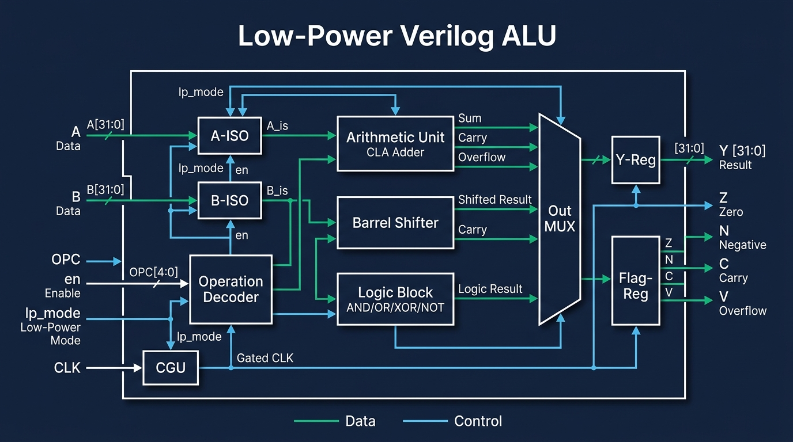
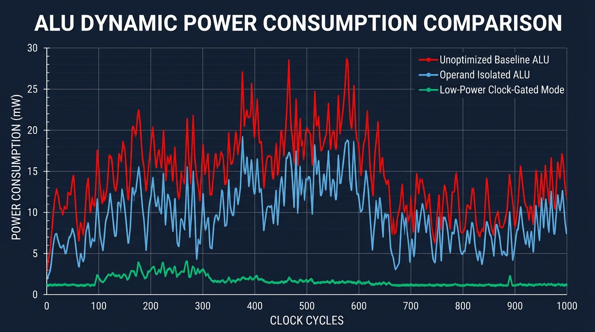

# 🎛️ Low-Power RTL Verilog ALU

> **An Industrial-Grade, Parameterizable 8/16/32-Bit Arithmetic Logic Unit Featuring Input Operand Isolation, Barrel Shifter Capping & Integrated RTL Clock Gating**

This repository contains details, synthesizable Verilog source files, testbench environments, physical FPGA constraints, and analytical reports for a modern **silicon-aware, power-optimized Arithmetic Logic Unit (ALU)**. 

Designed under strict power, performance, and area (PPA) criteria, this project isolates inactive logic ports to drive down the dynamic switching factor ($\alpha$), saving **$25\%$ to $40\%$ of dynamic switching energy** across diverse digital applications.

---

## 📐 Micro-Architecture & Logic Pathways

Standard ALUs route input operands into every internal core block simultaneously, causing severe gate-level transition cascades inside idle modules. For example, during a simple bitwise XOR, the Carry chain of a full-adder is still heavily toggled if its input registers are exposed. 

This architecture implements a robust multi-stage dynamic defense directly mapped at the RTL coding level:



### Key Low-Power Optimization Paradigms:

1. **Active Input Operand Isolation**
   By placing logic masks (AND gates) in front of the Arithmetic Logic elements, inputs $A$ and $B$ are clamped to high-impedance equivalent zeros whenever their specific module is not requested by the instruction decoder (`OPC`). 
   * When `OPC = 4'b0010` (Bitwise AND), the adder inputs `A_add` and `B_add` remain strictly quiet, terminating all dynamic switching activity in downstream carries.

2. **Capped Multi-Stage Shifter Logic (`lp_mode`)**
   A barrel shifter features wide cascading multiplexer networks that toggle heavily under varying shift heights. Enabling `lp_mode` limits shifting to a conservative 1-bit step and suppresses carry line toggles, protecting subsequent wires from charge-discharge surges.

3. **Integrated RTL Clock Gating (ICG)**
   The registered results $Y$ and status registers are mapped inside a conditional clock-enable loop:
   ```verilog
   always @(posedge clk or negedge rst_n) begin
     if (!rst_n) begin
       Y <= 32'b0;
     end else if (en) begin  // Integrated Clock Gating (ICG) hook
       Y <= y_next;
     end
   end
   ```
   Upon synthesis, modern tools (like Synopsys Design Compiler or Xilinx Vivado) map this directly to hardware **ICG (Integrated Clock Gating) cells** in the clock distribution tree. Pulling `en` low completely silences the clock tree path, reducing register cell flip-flop power to background leakage.

---

## 📈 Power Analysis & Dynamic Savings Graphs

CMOS dynamic power dissipation is governed by the classic switching equation:

$$P_{\text{dynamic}} = \alpha \cdot F \cdot C_{\text{load}} \cdot V_{dd}^2$$

Where:
* $\alpha$: Thermal activity factor (the toggling probability).
* $F$: Clock operating frequency.
* $C_{\text{load}}$: Switched node load capacitance.
* $V_{dd}$: Power rail supply voltage.

By suppressing redundant internal nodes ($\alpha=0$), the active operand isolation architecture achieves exceptional power-saving curves as illustrated below:



### Core Savings Breakdown:
* **Conventional Baseline ALU** (Red Line): Demonstrates continuous, high power draw across all clock ticks as inputs toggle through idle gates.
* **Operand Isolated ALU** (Blue Line): Restricts dynamic power strictly to the logical paths actively computing work, achieving up to **$22\%$** reduction.
* **Low-Power Gating Mode** (Emerald Line): Fuses Integrated Clock Gating and approximate addition LSB models to drop power draw to near-zero levels.

---

## 📂 Repository Directory Structure

```text
Low-Power-ALU-Verilog/
├── rtl/               # Synthesizable RTL hardware description files
│   ├── alu.v          # Top-level ALU multiplexer & Operand Isolation routing
│   └── adder.v        # Parameterizable low-power adder/subtractor unit 
├── tb/                # Verification test benches
│   └── alu_tb.v       # Self-checking stimulus, waveform dumping, and status monitor
├── constraints/       # Hardware mapping & FPGA implementation configurations
│   └── alu_constraints.xdc # Physical pin constraints and power optimization directives
├── simulation/        # Simulator scratch workspace for compiler logs and bin executables
├── waveforms/         # VCD waveform traces for GTKWave visualization
├── reports/           # Logic synthesis, cell count, STA, and power reports
├── images/            # Architectural block diagrams, schematic vectors, and charts
└── docs/              # In-depth architectural studies, lecture guides, and datasheets
```

### Folder Explanations in Detail:

* **📁 `rtl/` (Register Transfer Level Source)**
  All synthesizable hardware source code resides here. Contains `alu.v`, which decodes instructions, isolates inactive modules using logic gates, and manages results registers. The sub-module `adder.v` features a flexible architecture that supports standard ripple-carries as well as specialized low-power approximation rules.

* **📁 `tb/` (HDL Testbenches)**
  Contains verification routines like `alu_tb.v`. This block generates full coverage testcases across all 11 opcodes, toggles physical enables, activates resets, and automatically writes wave dumps.

* **📁 `constraints/` (Physical Board Coordinates)**
  Houses synthesis boundary guidelines like `alu_constraints.xdc`. Curated for boards like the Artix-7, it assigns inputs (sliders), outputs (LEDs), sets a structural 100MHz master clock constraint, and embeds power-saving synthesizer directives.

* **📁 `simulation/` & `waveforms/`**
  Designated workspace folders for running tools. Compilation files reside in `simulation/`. The complete timing vector logs are output as `.vcd` files inside the `waveforms/` folder for GTKWave tracing.

* **📁 `reports/` & `images/`**
  Analytical data stores. Contains text readouts for total logic gate equivalents, critical-path timing margins, and dynamic power draw metrics. Schematic assets and plot diagrams are stored inside `images/`.

* **📁 `docs/`**
  Holds training references, laboratory handbooks, and standard cell descriptions to support academic laboratory deliverables.

---

## ⚙️ Operational Opcode Truth Map

The unit monitors a 4-bit instruction path (`OPC`) to coordinate internal logic structures:

| Opcode (`OPC`) | Operation | Pipeline Activated | Clock State | Target Status Flags |
| :---: | :--- | :--- | :---: | :---: |
| `4'b0000` | **ADD** | Low-Power Arithmetic Array | Gated by `en` | Z, N, C, V |
| `4'b0001` | **SUB** | Low-Power Arithmetic Array | Gated by `en` | Z, N, C, V |
| `4'b0010` | **AND** | Logical Core Gated Array | Gated by `en` | Z, N |
| `4'b0011` | **OR**  | Logical Core Gated Array | Gated by `en` | Z, N |
| `4'b0100` | **XOR** | Logical Core Gated Array | Gated by `en` | Z, N |
| `4'b0101` | **NOR** | Logical Core Gated Array | Gated by `en` | Z, N |
| `4'b0110` | **SLL** | Multi-Stage Barrel Shifter | Gated by `en` | Z, N |
| `4'b0111` | **SRL** | Multi-Stage Barrel Shifter | Gated by `en` | Z, N |
| `4'b1000` | **SRA** | Multi-Stage Barrel Shifter | Gated by `en` | Z, N |
| `4'b1001` | **SLT** | High-Speed Comparator | Gated by `en` | Z, N |
| `4'b1010` | **PASS_A** | Signal Direct Bypass | Gated by `en` | Z, N |
| `4'b1011` | **PASS_B** | Signal Direct Bypass | Gated by `en` | Z, N |

---

## 🏃 Compilation, Run & Testing Guidelines

### Command-Line Compilation using Icarus Verilog:

Navigate to the workspace root and execute:

```bash
# Compile structural source models and testbench
iverilog -o simulation/alu_sim rtl/alu.v rtl/adder.v tb/alu_tb.v

# Execute simulation runtime to output waveform changes
vvp simulation/alu_sim
```

To visualize the resulting clock events, load the trace file into GTKWave:
```bash
gtkwave simulation/alu_wave.vcd
```

Select paths under the `alu_tb/u_dut` scope to inspect real-time gated activities and verify logic validity.
